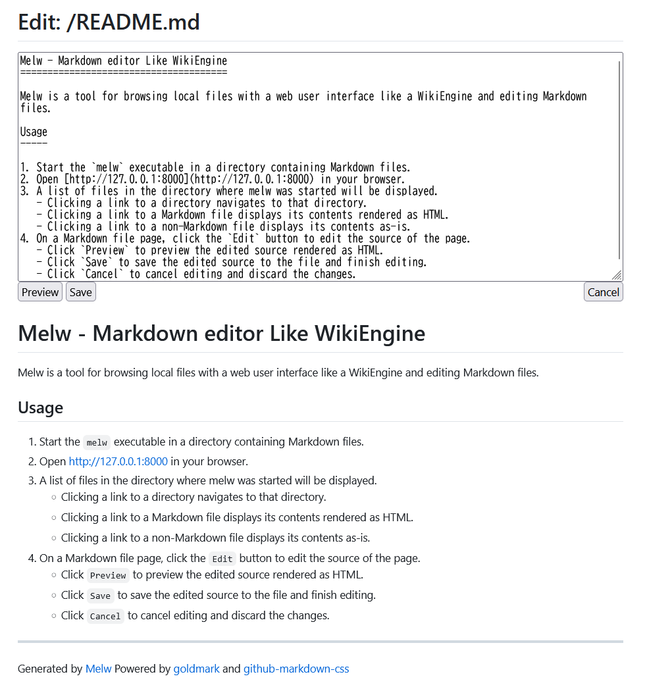

Melw - Markdown Editor Like WikiEngine
======================================
[English](./README.md) / Japanese


Melw は WikiEngine のような Web ユーザインターフェイスで、
Markdown ファイルを編集するツールです。

インストール
------------

### Manual Installation

[Releases](https://github.com/hymkor/melw/releases) よりバイナリパッケージをダウンロードして、実行ファイルを展開してください

<!-- go run github.com/hymkor/example-into-readme/cmd/how2install@master ja | -->

### [eget] インストーラーを使う場合 (クロスプラットフォーム)

```sh
brew install eget        # Unix-like systems
# or
scoop install eget       # Windows

cd (YOUR-BIN-DIRECTORY)
eget hymkor/melw
```

[eget]: https://github.com/zyedidia/eget

### [scoop] インストーラーを使う場合 (Windowsのみ)

```
scoop install https://raw.githubusercontent.com/hymkor/melw/master/melw.json
```

もしくは

```
scoop bucket add hymkor https://github.com/hymkor/scoop-bucket
scoop install melw
```

[scoop]: https://scoop.sh/

### "go install" を使う場合 (要Go言語開発環境)

```
go install github.com/hymkor/melw@latest
```

`go install` は `$HOME/go/bin` もしくは `$GOPATH/bin` へ実行ファイルを導入するので、`melw` を実行するにはそのディレクトリを `$PATH` に追加する必要があります。
<!-- -->


使い方
------

1. Markdown ファイルがあるディレクトリで、`melw` の実行ファイルを起動してください。
2. ブラウザで [http://127.0.0.1:8000](http://127.0.0.1:8000) を開いてください。
3. melw を起動したディレクトリのファイル一覧がブラウザに表示されます。
   - ディレクトリへのリンクをクリックすると、そのディレクトリに移動します。
   - Markdown ファイルへのリンクをクリックすると、その内容をレンダリングした画面が表示されます。
   - Markdown ファイル以外へのリンクをクリックすると、そのファイルの内容がそのまま表示されます。
4. Markdown ファイルのページで `Edit` ボタンを押すと、そのページのソースを編集する画面になります。
   - `Preview` ボタンを押すと、編集したソースをレンダリングした結果をプレビューできます。
   - `Save` ボタンを押すと、編集したソースをファイルに反映して、編集を終了します。
   - `Cancel` ボタンを押すと、編集を中止し、編集内容を破棄します。

スクリーンショット
------------------


